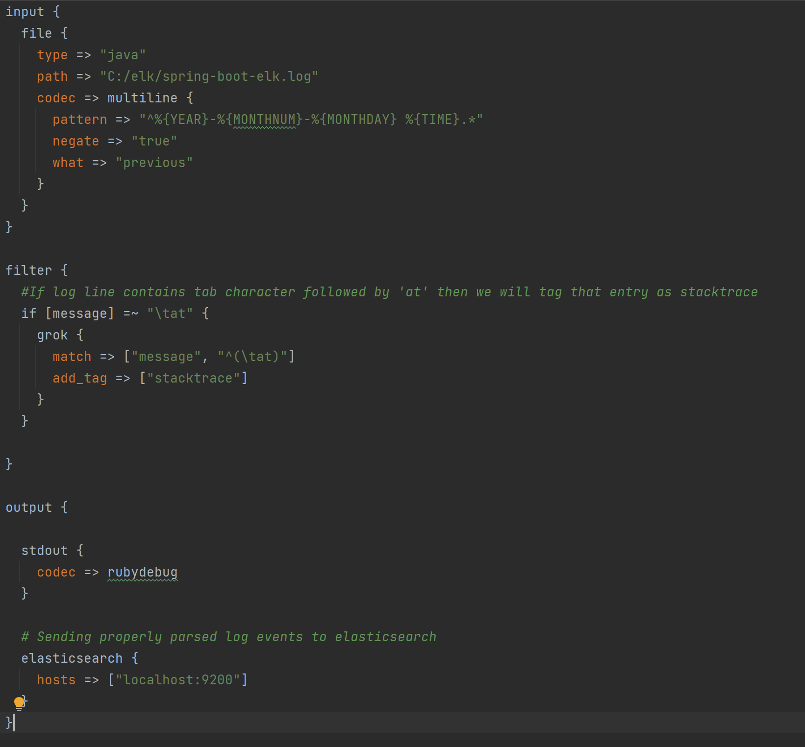
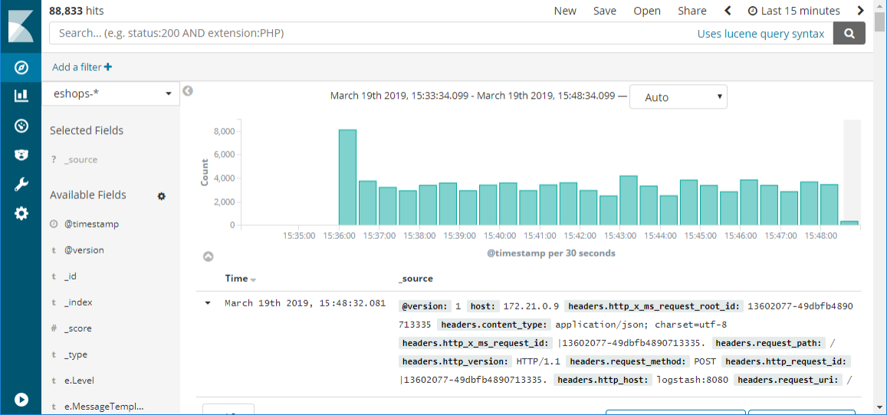

## ELK Stack with a Spring-boot application

(Zeljko helped me with this assignment)

### Spring Application

application.properties:

logging.file.path=C:/elk/spring-boot-elk

Code for a Controller:

    @RestController
    public class ErrorController {
    private static final Logger LOG = "errorController";

        @RequestMapping(path = "/err")
        public String exception(){
            String response = "";
            try{
                throw new Exception("An Error has occurred");
            } catch (Exception e) {
                e.printStackTrace();
                LOG.error(e);

                StringWriter swr = new StringWriter();
                e.printStackTrace(new PrintWriter(swr));
                String stackTrace = sw.toString();
                LOG.error("Exception " + stackTrace);
                response = stackTrace;
            }

            return response;
        }
    }

### Configuring the logstash 

logstash.conf:

### Start the elk stack

    docker-compose up

### Logs

Start the application and use rest calls, then go to Kibana 

    localhost:5601

click discover (in the nav bar)

then import the log file

### Dashboard:

The Dashboard then should look like this: (unfortunately I had a problem with mine so I looked up a picture from the internet)

